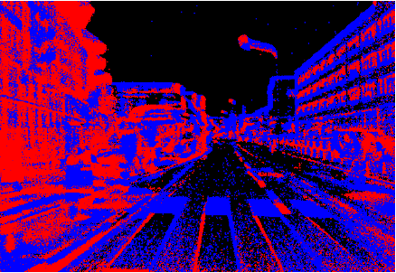
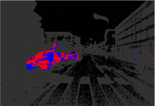
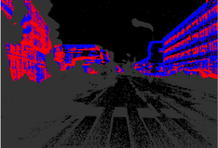
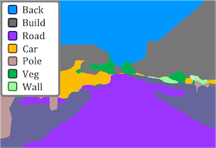
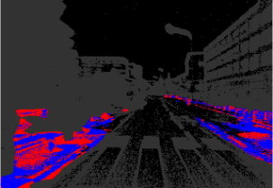
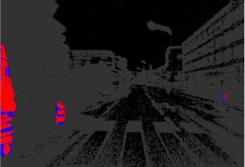
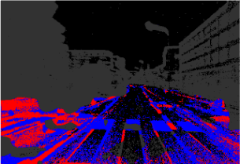
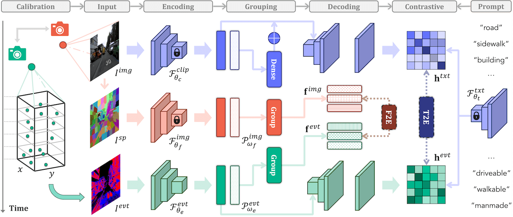
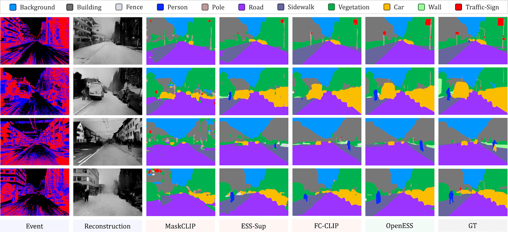

<p align="right">English | <a href="./README_CN.md">简体中文</a></p>  


<p align="center">
  
  
  <h3 align="center"><strong>OpenESS: Event-Based Semantic Scene Understanding with Open Vocabularies</strong></h3>

  <p align="center">
      <a href="https://ldkong.com/" target='_blank'>Lingdong Kong</a><sup>1,2</sup>&nbsp;&nbsp;&nbsp;
      <a href="https://github.com/youquanl" target='_blank'>Youquan Liu</a><sup>3</sup>&nbsp;&nbsp;&nbsp;
      <a href="https://ipal.cnrs.fr/lai-xing-ng/" target='_blank'>Lai Xing Ng</a><sup>4</sup>&nbsp;&nbsp;&nbsp;
      <a href="https://ipal.cnrs.fr/benoit-cottereau-personal-page/" target='_blank'>Benoit R. Cottereau</a><sup>5,6</sup>&nbsp;&nbsp;&nbsp;
      <a href="https://www.comp.nus.edu.sg/cs/people/ooiwt/" target='_blank'>Wei Tsang Ooi</a><sup>1</sup>
    </br>
  <sup>1</sup>National University of Singapore&nbsp;&nbsp;&nbsp;
  <sup>2</sup>CNRS@CREATE&nbsp;&nbsp;&nbsp;
  <sup>3</sup>Hochschule Bremerhaven&nbsp;&nbsp;&nbsp;
  <sup>4</sup>Institute for Infocomm Research, A*STAR&nbsp;&nbsp;&nbsp;
  <sup>5</sup>IPAL, CNRS IRL 2955, Singapore&nbsp;&nbsp;&nbsp;
  <sup>6</sup>CerCo, CNRS UMR 5549, Universite Toulouse III
  </p>

</p>

<p align="center">
  <a href="https://ldkong.com/PDF/2024_cvpr_OpenESS.pdf" target='_blank'>
    
  </a>
  
  <a href="https://ldkong.com/OpenESS" target='_blank'>
    
  </a>
  
  <a href="" target='_blank'>
    
  </a>
  
  <a href="" target='_blank'>
    
  </a>
  
  <a href="https://hits.seeyoufarm.com">
    
  </a>
</p>


## About

`OpenESS` is an open-vocabulary event-based semantic segmentation (ESS) framework that synergizes information from image, text, and event-data domains to enable scalable ESS in an open-world, annotation-efficient manner. 

|  |  |  |  |
| :-: | :-: | :-: | :-: |
| Input Event Stream | “Driveable” | “Car” | “Manmade” |
|  |  |  |  |
| Zero-Shot ESS | “Walkable” | “Barrier” | “Flat” |


## Updates

- \[2024.05\] - Our paper is available on arXiv, click [here](https://ldkong.com/PDF/2024_cvpr_OpenESS.pdf) to check it out. The code will be available later.
- \[2024.04\] - [OpenESS](https://ldkong.com/PDF/2024_cvpr_OpenESS.pdf) was selected as a :sparkles: highlight :sparkles: at [CVPR 2024](https://cvpr.thecvf.com/Conferences/2024) (2.8% = 324/11532). 
- \[2024.02\] - [OpenESS](https://ldkong.com/PDF/2024_cvpr_OpenESS.pdf) was accepted to [CVPR 2024](https://cvpr.thecvf.com/Conferences/2024)! :tada:


## Outline
- [Installation](#gear-installation)
- [Data Preparation](#hotsprings-data-preparation)
- [Getting Started](#rocket-getting-started)
- [Benchmark](#bar_chart-benchmark)
- [TODO List](#memo-todo-list)
- [Citation](#citation)
- [License](#license)
- [Acknowledgements](#acknowledgements)


## :gear: Installation

Kindly refer to [INSTALL.md](docs/INSTALL.md) for the installation details.


## :hotsprings: Data Preparation

Kindly refer to [DATA_PREPARE.md](docs/DATA_PREPARE.md) for the details to prepare the [DDD17-Seg]() and [DSEC-Semantic]() datasets.


## :rocket: Getting Started

Please refer to [GET_STARTED.md](docs/GET_STARTED.md) to learn more about how to use this codebase.


## :bar_chart: Benchmark

### OpenESS Framework

|  |
| :-: |


### Annotation-Free ESS

To be updated.


### Fully-Supervised ESS

To be updated.


### Open-Vocabulary ESS

To be updated.


### Qualitative Assessment

|  |
| :-: |


## :memo: TODO List

To be updated.


## Citation
If you find this work helpful, please kindly consider citing our paper:
```bibtex
@inproceedings{kong2024openess,
  title = {OpenESS: Event-Based Semantic Scene Understanding with Open Vocabularies},
  author = {Kong, Lingdong and Liu, Youquan and Ng, Lai Xing and Cottereau, Benoit R. and Ooi, Wei Tsang},
  booktitle = {IEEE/CVF Conference on Computer Vision and Pattern Recognition (CVPR)},
  year = {2024},
}
```

## License

This work is under the [Apache License Version 2.0](https://www.apache.org/licenses/LICENSE-2.0), while some specific implementations in this codebase might be with other licenses. Kindly refer to [LICENSE.md](https://github.com/ldkong1205/Calib3D/blob/main/docs/LICENSE.md) for a more careful check, if you are using our code for commercial matters.


## Acknowledgements

To be updated.
