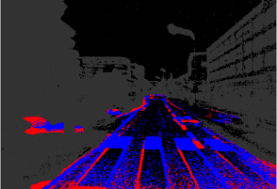

<p align="center">
  
  
  <h1 align="center"><strong>OpenESS: Event-Based Semantic Scene Understanding with Open Vocabularies</strong></h1>

  <p align="center">
      <a href="https://ldkong.com/" target='_blank'>Lingdong Kong</a><sup>1,2</sup>&nbsp;&nbsp;&nbsp;
      <a href="https://github.com/youquanl" target='_blank'>Youquan Liu</a><sup>3</sup>&nbsp;&nbsp;&nbsp;
      <a href="https://ipal.cnrs.fr/lai-xing-ng/" target='_blank'>Lai Xing Ng</a><sup>4</sup>&nbsp;&nbsp;&nbsp;
      <a href="https://ipal.cnrs.fr/benoit-cottereau-personal-page/" target='_blank'>Benoit R. Cottereau</a><sup>5,6</sup>&nbsp;&nbsp;&nbsp;
      <a href="https://www.comp.nus.edu.sg/cs/people/ooiwt/" target='_blank'>Wei Tsang Ooi</a><sup>1</sup>
  </br>
  <sup>1</sup>National University of Singapore&nbsp;&nbsp;&nbsp;
  <sup>2</sup>CNRS@CREATE&nbsp;&nbsp;&nbsp;
  <sup>3</sup>Hochschule Bremerhaven&nbsp;&nbsp;&nbsp;
  <sup>4</sup>Institute for Infocomm Research, A*STAR&nbsp;&nbsp;&nbsp;
  <sup>5</sup>IPAL, CNRS IRL 2955, Singapore&nbsp;&nbsp;&nbsp;
  <sup>6</sup>CerCo, CNRS UMR 5549, Universite Toulouse III
  </p>

</p>


## About

`OpenESS` is an open-vocabulary event-based semantic segmentation (ESS) framework that synergizes information from image, text, and event-data domains to enable scalable ESS in an open-world, annotation-efficient manner. 

|  |  |  |  |
| :-: | :-: | :-: | :-: |
| Input Event Stream | “Driveable” | “Car” | “Manmade” |
|  |  |  |  |
| Zero-Shot ESS | “Walkable” | “Barrier” | “Flat” |


## Table of Contents

- [:gear: Installation](#gear-installation)
- [:hotsprings: Data Preparation](#hotsprings-data-preparation)
  - [DSEC-Semantic](#dsec-semantic)
  - [DDD17-Seg](#ddd17-seg)
- [:rocket: Getting Started](#rocket-getting-started)
  - [Stage 1: Model Pretraining](#stage-1-model-pretraining)
  - [Stage 2: Linear Probing](#stage-2-linear-probing)
  - [Stage 3: Fine-Tuning](#stage-3-fine-tuning)
- [Benchmark](#benchmark)
  - [OpenESS Framework](#openess-framework)
  - [Annotation-Free ESS](#annotation-free-ess)
  - [Fully-Supervised ESS](#fully-supervised-ess)
  - [Open-Vocabulary ESS](#open-vocabulary-ess)
  - [Qualitative Assessment](#qualitative-assessment)
- [Citation](#citation)
- [License](#license)
- [Acknowledgements](#acknowledgements)


## :gear: Installation

Kindly refer to [INSTALL.md](docs/INSTALL.md) for the installation details.


## :hotsprings: Data Preparation

### DSEC-Semantic

- **Step 1:** Download the DSEC dataset from the [official dataset page](https://dsec.ifi.uzh.ch/). Below, we summarize the links used for downloading each of the resources:

  | Training Data | Link | Size | Description |
  |:-:|:-:|:-:|:-|
  | Events | [download](https://download.ifi.uzh.ch/rpg/DSEC/train_coarse/train_events.zip) | 125 GB | The raw event data in .h5 format |
  | Frames | [download](https://download.ifi.uzh.ch/rpg/DSEC/train_coarse/train_images.zip) | 216 GB | The RGB frames in .png format |
  | Disparities | [download](https://download.ifi.uzh.ch/rpg/DSEC/train_coarse/train_disparity.zip) | 12 GB | The disparities between left and right sensors |
  | Semantic Masks | [download](https://download.ifi.uzh.ch/rpg/DSEC/semantic/train_semantic_segmentation.zip) | 88.6 MB | The ground truth semantic segmentation labels |
  
  | Test Data | Link | Size | Description |
  |:-:|:-:|:-:|:-|
  | Events | [download](https://download.ifi.uzh.ch/rpg/DSEC/test_coarse/test_events.zip) | 27 GB | The raw event data in .h5 format |
  | Frames | [download](https://download.ifi.uzh.ch/rpg/DSEC/test_coarse/test_images.zip) | 43 GB | The RGB frames in .png format |
  | Semantic Masks | [download](https://download.ifi.uzh.ch/rpg/DSEC/semantic/test_semantic_segmentation.zip) | 28.9 MB | The ground truth semantic segmentation labels |


- **Step 2:** Link the dataset to path `./data`. Your dataset folder should end up aligning with the following dataset structure:
  ```
  ./data/DSEC
          ├── test
          │     ├── zurich_city_13_a
          │     │    ├── events
          │     │    │    └── left
          │     │    │          └── events.h5
          │     │    ├── images
          │     │    │    └── left
          │     │    │          │── 000000.png
          │     │    │          │── ...
          │     │    │          └── 000378.png
          │     │    ├── images_aligned
          │     │    │    └── left
          │     │    │    │── 000000.png
          │     │    │    │── ...
          │     │    │    └── 000378.png
          │     │    ├── reconstructions
          │     │    │    └── left
          │     │    │          │── 000000.png
          │     │    │          │── ...
          │     │    │          └── 000378.png
          │     │    └── semantic
          │     │         └── left
          │     │               │── 000000.png
          │     │               │── ...
          │     │               └── 000378.png
          │     ├── zurich_city_14_c
          │     └── zurich_city_15_a
          └── train
                ├── zurich_city_00_a
                ├── zurich_city_01_a
                ├── zurich_city_02_a
                ├── zurich_city_04_a
                ├── zurich_city_05_a
                ├── zurich_city_06_a
                ├── zurich_city_07_a
                └── zurich_city_08_a
  ```

- **Step 3:** Prepare frame data that aligns with the events. Please follow the same procedure from [Sun et al.](https://github.com/uzh-rpg/ess) (ESS: Learning Event-based Semantic Segmentation from Still Images), and place the processed frame data into the folder named `images_aligned`. 

  Additionally, we provided our processed DSEC-Semantic frame data at [this](https://drive.google.com/file/d/1Jp-qIlbmpqKjrH_fL6eLq8Jdm4IsCKbK/view?usp=sharing) Google Drive link (~4.95 GB).


- **Step 4:** Prepare the zero-shot semantic labels for T2E: Text-to-Event Consistency Regularization. For more details, kindly refer to [FC-CLIP.md](https://github.com/ldkong1205/ess_open/blob/main/fc-clip/generate.md).

  Additionally, we provided our generated DSEC-Semantic T2E labels at [this](https://drive.google.com/file/d/1FkfhilIYbfFafTBAjYOMu2VAdOnhH537/view?usp=sharing) Google Drive link (~47.5 MB).


- **Step 5:** Prepare the event reconstruction data. Please follow the same procedure from [Sun et al.](https://github.com/uzh-rpg/ess) (ESS: Learning Event-based Semantic Segmentation from Still Images), and place the processed frame data into the folder named `images_aligned`. 

  The pretrained E2VID model can be downloaded from [this](https://github.com/uzh-rpg/rpg_e2vid) link and should be placed under the folder `/e2vid/pretrained/`. 
  
  Additionally, we provided our processed DSEC-Semantic event reconstruction data at [this](https://drive.google.com/file/d/1i6BJVDF0aMlSz5Y2lcBKghJs6NhLHbvc/view?usp=sharing) Google Drive link (~2.41 GB).


- **Step 6:** Generate the semantic superpixels of [SAM](https://github.com/facebookresearch/segment-anything) for DSEC-Semantic. You should first download the pretrained SAM model from [this](https://github.com/facebookresearch/segment-anything?tab=readme-ov-file#model-checkpoints) link. 

  Next, run the following scripts to generate the superpixels:

  ```bash
  # for training set
  python data_preparation/superpixel_generation_dsec_sam.py -r data/DSEC/train
  
  # for test set
  python data_preparation/superpixel_generation_dsec_sam.py -r data/DSEC/test
  ```

  The generated superpixels should be placed in the folder named `sp_sam_rgb`.


- **Step 7:** Generate the semantic superpixels of [SLIC](https://github.com/PSMM/SLIC-Superpixels) for DSEC-Semantic. You can directly run the following script to generate the superpixels:

  ```bash
  python data_preparation/superpixel_segmenter_dsec_slic.py --worker $WORKER_NUM --num_segments $SEGMENTS_NUM
  ```

  The generated superpixels should be placed in the folder named `sp_slic_rgb`.


To summarize, for each of the sequences in DSEC-Semantic, we expect that you prepare the following data for running the experiments:
```
./sequence_name
    ├── events
    ├── images
    ├── images_aligned
    ├── pl_fcclip_rgb
    ├── reconstructions
    ├── semantic
    ├── sp_sam_rgb
    └── sp_slic_rgb
```


### DDD17-Seg

- **Step 1:** Download the DDD17 dataset from the [official dataset page](http://sensors.ini.uzh.ch/news_page/DDD17.html) and/or from the [Ev-SegNet](https://github.com/Shathe/Ev-SegNet) paper.


- **Step 2:** Link the dataset to path ./data. Your dataset folder should end up aligning with the following dataset structure:
  ```
  ./data/DDD17
          ├── dir0
          │    ├── events.dat.t
          │    ├── events.dat.xyp
          │    ├── index
          │    │     │── index_10ms.npy
          │    │     │── index_50ms.npy
          │    │     └── index_250ms.npy
          │    ├── images
          │    │     │── img_00000002.png
          │    │     │── ...
          │    │     └── img_00011178.png
          │    ├── images_aligned
          │    │     │── img_00000002.png
          │    │     │── ...
          │    │     └── img_00011178.png
          │    ├── reconstructions
          │    │     │── img_00000002.png
          │    │     │── . . .
          │    │     └── img_00011178.png
          │    └── segmentation_masks
          │          │── img_00000002.png
          │          │── . . .
          │          └── img_00011178.png
          ├── dir1
          ├── dir3
          ├── dir4
          ├── dir6
          └── dir7
  ```


- **Step 3:** Prepare frame data that aligns with the events. Please follow the same procedure from [Sun et al.]( https://github.com/uzh-rpg/ess) (ESS: Learning Event-based Semantic Segmentation from Still Images), and place the processed frame data into the folder named `images_aligned`. Additionally, we provided our processed DDD17-Seg frame data at [this](https://drive.google.com/file/d/1h4C8bcEhF0vq7y2IyTGOdQ2GtaK8_rUa/view?usp=sharing) Google Drive link (~1.5 GB).


- **Step 4:** Prepare the zero-shot semantic labels for T2E: Text-to-Event Consistency Regularization. For more details, kindly refer to [FC-CLIP.md](https://github.com/ldkong1205/ess_open/blob/main/fc-clip/generate.md).

  Additionally, we provided our generated DDD17-Seg T2E labels at [this](https://drive.google.com/file/d/19n7HQtP_WApJJga71IDmmw_v5aNM6cg2/view?usp=sharing) Google Drive link (~29.6 MB).


- **Step 5:** Prepare the event reconstruction data. Please follow the same procedure from [Sun et al.](https://github.com/uzh-rpg/ess) (ESS: Learning Event-based Semantic Segmentation from Still Images), and place the processed frame data into the folder named `images_aligned`. 

  The pretrained E2VID model can be downloaded from [this](https://github.com/uzh-rpg/rpg_e2vid) link and should be placed under the folder `/e2vid/pretrained/`. 
  
  Additionally, we provided our processed DDD17-Seg event reconstruction data at [this](https://drive.google.com/file/d/1Ss4aWy0QgGAeptVDNo8hK7fJ83U275JQ/view?usp=sharing) Google Drive link (~1.14 GB).


- **Step 6:** Generate the semantic superpixels of [SAM](https://github.com/facebookresearch/segment-anything) for DDD17-Seg. You should first download the pretrained SAM model from [this](https://github.com/facebookresearch/segment-anything?tab=readme-ov-file#model-checkpoints) link. 

  Next, run the following scripts to generate the superpixels:
  ``` bash
  # if you use a single GPU
  python data_preparation/superpixel_generation_ddd17_sam.py
  
  # if you use multi-GPUs
  python data_preparation/superpixel_generation_ddd17_sam_ddp.py -r data/DDD17 \
  -p pretrained_checkpoints/sam_vit_h_4b8939.pth --skip_exist
  ```

  The generated superpixels should be placed in the folder named `sp_sam_rgb`.


- **Step 7:** Generate the semantic superpixels of [SLIC](https://github.com/PSMM/SLIC-Superpixels) for DDD17-Seg. You can directly run the following script to generate the superpixels:

  ```bash
  python data_preparation/superpixel_segmenter_ddd17_slic.py --workers $WORKER_NUM --num_segments $SEGMENTS_NUM
  ```

  The generated superpixels should be placed in the folder named `sp_slic_rgb`.


To summarize, for each of the sequences in DDD17-Seg, we expect that you prepare the following data for running the experiments:
```
./sequence_name
    ├── events.dat.t
    ├── events.dat.xyp
    ├── images
    ├── images_aligned
    ├── index
    ├── pl_fcclip_rgb
    ├── reconstructions
    ├── segmentation_masks
    ├── sp_sam_rgb
    └── sp_slic_rgb
```


## :rocket: Getting Started

### Stage 1: Model Pretraining

The first stage of our framework is to do the F2E: Frame-to-Event Contrastive Distillation and T2E: Text-to-Event Consistency Regularization.

To help you with this pretraining process, we have prepared the ready-to-use configuration files (in `.yaml` format). You can find these files inside the `config/pretrain` directory.

We include the settings for pretraining on the two datasets, DSEC-Semantic and DDD17-Seg, where the superpixels (constructed with either SAM or SLIC) and event representations have already been specified in the configuration files.

**Important:** Please make sure that the dataset directory structure strictly follows our required format.

#### :gear: Configuration Options
The main settings related can be adjusted directly in the configuration files. Below, we describe the configurable options and their valid ranges in detail:

| Configuration | Valid Range | Options |
|:-:|:-|:-:|
| Log Directory | `dir` -> `log` | - |
| Event Representation | `clip` -> `config_option` | {`'frame2recon'`, `'frame2voxel'`, `'recon2voxel'`} |
| Superpixel Source | `clip` -> `superpixel_sources` | {`'sp_sam_rgb'`, `'sp_slic_rgb'`} |
| Superpixel Size | `clip` -> `superpixel_size` | - |
| F2E Pretrained Model | `clip` -> `image_weights` | {`'moco_v1'`, `'moco_v2'`, `'swav'`, `'deepcluster_v2'`, `'dino'`}
| T2E Generation Model | `clip` -> `pl_sources` | {`'pl_fcclip_rgb'`, `'pl_maskclip_rgb'`} |

#### :runner: Ready to Run
To launch the pretraining experiments, simply run the following command with your selected configuration file:
```bash
python train.py --settings_file ${SELECTED_CONFIG_PATH}
```

Currently, the code only supports single-GPU pretraining. If you would like to use multiple GPUs together for pretraining, please adjust the code accordingly.


### Stage 2: Linear Probing
In our experimental settings, the linear probing is used for a lightweight evaluation of pretrained model weights; only a small set of linear layers are trainable while the model backbone remains frozen. 

This approach provides a quick validation of the quality of representations learned during the pretraining.

To help you with this linear probing process, we have prepared the ready-to-use configuration files (in `.yaml` format). You can find these files inside the `config/linear_probe` directory.

Similar to the pretraining stage, we include settings for both DSEC-Semantic and DDD17-Seg datasets, where the superpixels (constructed with either SAM or SLIC) and event representations have already been specified in the configuration files.

#### :gear: Configuration Options
The main settings related can be adjusted directly in the configuration files. Below, we describe the configurable options and their valid ranges in detail:

| Configuration | Valid Range | Options |
|:-:|:-|:-:|
| Log Directory | `dir` -> `log` | - |
| Event Representation | `clip` -> `config_option` | {`'frame2recon'`, `'frame2voxel'`, `'recon2voxel'`} |
| Superpixel Source | `clip` -> `superpixel_sources` | {`'sp_sam_rgb'`, `'sp_slic_rgb'`} |
| Pretrained Weight | `clip` -> `pre_trained_backbone` | - |

#### :runner: Ready to Run
To launch the linear probing experiments, simply run the following command with your selected configuration file:
```bash
python train.py --settings_file ${SELECTED_CONFIG_PATH}
```


### Stage 3: Fine-Tuning

In the model fine-tuning stage, we evaluate the performance of our model under different levels of supervision, i.e., varying the proportion of ground truth semantic labels used.

As usual, to help you with this linear probing process, we have prepared the ready-to-use configuration files (in `.yaml` format). You can find these files inside the `config/finetunes` directory.

Similar to the pretraining and linear probing stages, we include settings for both DSEC-Semantic and DDD17-Seg datasets, where the superpixels (constructed with either SAM or SLIC) and event representations have already been specified in the configuration files.

#### :gear: Configuration Options
The main settings related can be adjusted directly in the configuration files. Below, we describe the configurable options and their valid ranges in detail:

| Configuration | Valid Range | Options | Mapping |
|:-:|:-|:-:|:-:|
| Log Directory | `dir` -> `log` | - | - |
| Event Representation | `clip` -> `config_option` |{`'frame2recon'`, `'frame2voxel'`, `'recon2voxel'`} | - |
| Superpixel Source | `clip` -> `superpixel_sources` |{`'sp_sam_rgb'`, `'sp_slic_rgb'`} | - |
| Pretrained Weight | `clip` -> `pre_trained_backbone` | - |
| Label Ratio | `clip -> skip_ratio` | {`'100'`, `'20'`, `'10'`, `'5'`, `'1'`} | { `'1'`: 100%, `'5'`: 20%, `'10'`: 10%, `'20'`: 5%, `'100'`: 1% } |
| Training Epochs | `clip` -> `num_epochs` | - | - |

#### :runner: Ready to Run
To launch the fine-tuning experiments, simply run the following command with your selected configuration file:
```bash
python train.py --settings_file ${SELECTED_CONFIG_PATH}
```

Here, we provide several trained models and the training logs to help you better understand the experiments, as well as reproduce the results reported in the paper. These materials are open-sourced at [this](https://drive.google.com/drive/folders/1ekgdVb4U7EKqeeFD56W9JswuoEtEIkGP?usp=drive_link) Google Drive link.

Additionally, to help you with the result visualizations, we also provide our processed color labels for both DSEC-Semantic and DDD17-Seg. We use the color maps following their original papers. These materials are open-sourced at [this](https://drive.google.com/file/d/12ajNYk6UkSZbN97gKhCC-jhhA9j39oHc/view?usp=sharing) (for DSEC-Semantic) and [this](https://drive.google.com/file/d/1oCOAFP-QutMZXGtiaq5Y7XUZETiLqj0Y/view?usp=sharing) (for DDD17-Seg) Google Drive links.


## Benchmark

### OpenESS Framework

|  |
| :-: |


### Annotation-Free ESS

| Method | Venue | DDD17 Acc | DDD17 mIoU | DSEC Acc | DSEC mIoU |
|:-:|-:|:-:|:-:|:-:|:-:|
| MaskCLIP    | ECCV'22     | 81.29     | 31.90      | 58.96    | 21.97     |
| FC-CLIP     | NeurIPS'23  | 88.66     | 51.12      | 79.20    | 39.42     |
| **OpenESS** | **Ours**    | **90.51** | **53.93**  | **86.18**| **43.31** |


### Fully-Supervised ESS

| Method | Venue | DDD17 Acc | DDD17 mIoU | DSEC Acc | DSEC mIoU |
|:-:|-:|:-:|:-:|:-:|:-:|
| Ev-SegNet     | CVPRW'19  | 89.76     | 54.81      | 88.61    | 51.76     |
| E2VID         | TPAMI'19  | 85.84     | 48.47      | 80.06    | 44.08     |
| Vid2E         | CVPR'20   | 90.19     | 56.01      | -        | -         |
| EVDistill     | CVPR'21   | -         | 58.02      | -        | -         |
| DTL           | ICCV'21   | -         | 58.80      | -        | -         |
| PVT-FPN       | ICCV'21   | 94.28     | 53.89      | -        | -         |
| SpikingFCN    | NCE'22    | -         | 34.20      | -        | -         |
| EV-Transfer   | RA-L'22   | 51.90     | 15.52      | 63.00    | 24.37     |
| ESS           | ECCV'22   | 88.43     | 53.09      | 84.17    | 45.38     |
| ESS-Sup       | ECCV'22   | 91.08     | **61.37**  | 89.37    | 53.29     |
| P2T-FPN       | TPAMI'23  | 94.57     | 54.64      | -        | -         |
| EvSegformer   | TIP'23    | **94.72** | 54.41      | -        | -         |
| HMNet-B       | CVPR'23   | -         | -          | 88.70    | 51.20     |
| HMNet-L       | CVPR'23   | -         | -          | **89.80**| **55.00** |
| HALSIE        | WACV'24   | 92.50     | 60.66      | 89.01    | 52.43     |


### Open-Vocabulary ESS

| Method      | Venue      | DDD17 Acc | DDD17 mIoU | DSEC Acc | DSEC mIoU |
|:-:|-:|:-:|:-:|:-:|:-:|
| MaskCLIP    | ECCV'22    | 90.50     | 61.27      | 89.81    | 55.01     |
| FC-CLIP     | NeurIPS'23 | 90.68     | 62.01      | 89.97    | 55.67     |
| **OpenESS** | **Ours**   | **91.05** | **63.00**  | **90.21**| **57.21** |


### Qualitative Assessment

|  |
| :-: |


## Citation
If you find this work helpful, please kindly consider citing our paper:
```bibtex
@inproceedings{kong2024openess,
  title     = {OpenESS: Event-Based Semantic Scene Understanding with Open Vocabularies},
  author    = {Lingdong Kong and Youquan Liu and Lai Xing Ng and Benoit R. Cottereau and Wei Tsang Ooi},
  booktitle = {Proceedings of the IEEE/CVF Conference on Computer Vision and Pattern Recognition},
  pages     = {15686-15698},
  year      = 2024,
}
```

## License

This work is under the [Apache License Version 2.0](https://www.apache.org/licenses/LICENSE-2.0), while some specific implementations in this codebase might be with other licenses. Kindly refer to the original papers and repositories for a more careful check, if you are using our code for commercial matters.


## Acknowledgements

This work is under the programme DesCartes
and is supported by the National Research Foundation, Prime Minister’s Office, Singapore, under its Campus for Research Excellence and Technological Enterprise (CREATE) programme. :heart:
